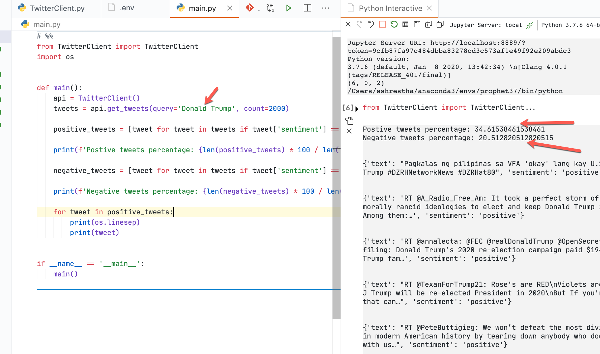

## Tweet Analysis

### How to Run
- Create a Twitter app at https://developer.twitter.com/en/apps
- Create .env file with env vars `TWITTER_CONSUMER_KEY, TWITTER_CONSUMER_SECRET, TWITTER_ACCESS_TOKEN, TWITTER_ACCESS_TOKEN_SECRET`

### Screenshot

### References
https://www.geeksforgeeks.org/twitter-sentiment-analysis-using-python/

### To generate python requirements file
- `pipreqs --print --force .  | sort > requirements.txt`
